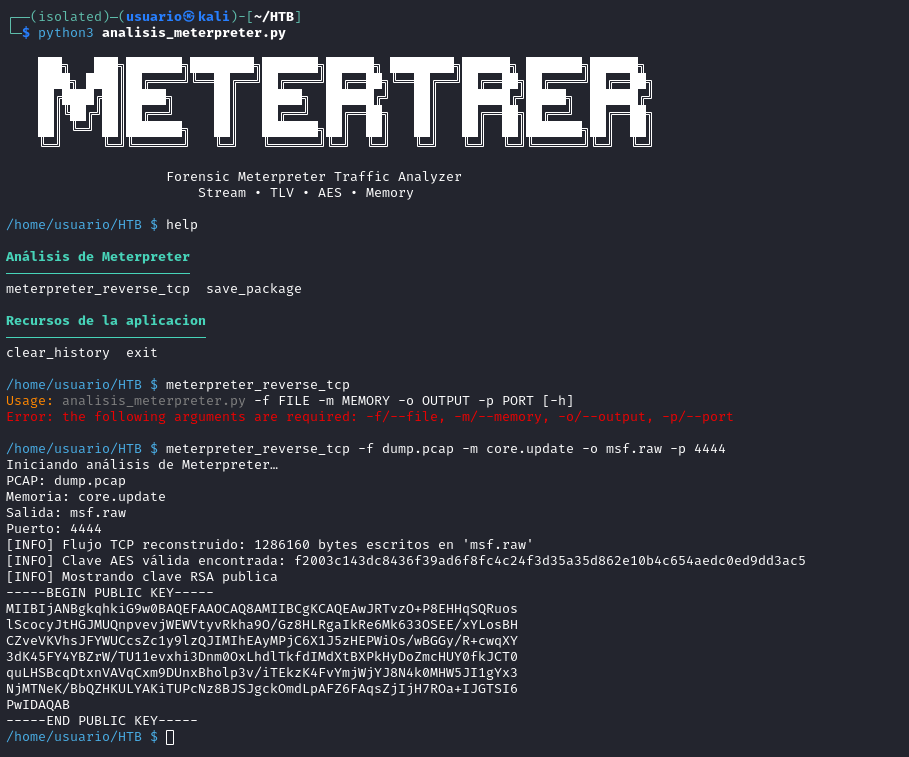
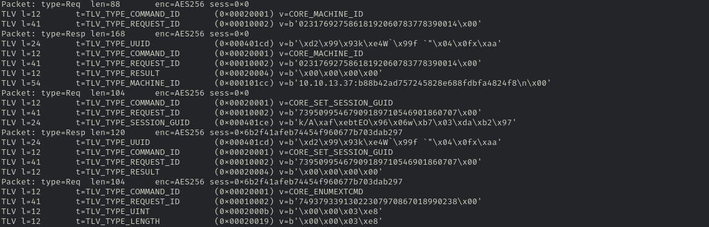
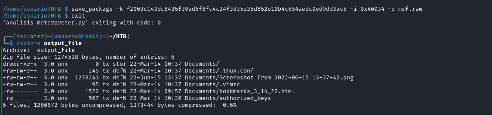

# 🕵️‍♂️ Forensic Meterpreter Traffic Analyzer

Aplicación forense diseñada para analizar, clasificar y visualizar tráfico generado por sesiones Meterpreter. Permite identificar patrones, comandos y comportamientos característicos del payload, facilitando investigaciones de intrusión y ejercicios de respuesta ante incidentes.

El proyecto ha sido testeado en entornos reales de entrenamiento, incluyendo:

La máquina Response de Hack The Box

El challenge Shadow of the Undead

Su objetivo es ofrecer una herramienta ligera y comprensible para analistas que necesiten estudiar tráfico malicioso sin depender de soluciones complejas o propietarias.

✨ Características principales
Detección y parsing de tráfico asociado a Meterpreter

Identificación de comandos y fases de interacción

Visualización clara de eventos relevantes

Pensado para entornos de DFIR y análisis educativo

La siguiente imagen muestra la ejecución de la herramienta analisis_meterpreter.py en un entorno Kali Linux, durante una simulación de respuesta ante incidentes basada en la máquina Response de Hack The Box.

Tras invocar el modo meterpreter_reverse_tcp, se realiza un análisis completo del tráfico capturado en el archivo dump.pcap, correlacionado con una muestra de memoria (core.update). El proceso reconstruye el flujo TCP, identifica la clave AES utilizada en la sesión y extrae la clave pública RSA del payload.

Este tipo de análisis permite validar la presencia de una sesión Meterpreter activa, identificar el canal de comunicación cifrado y extraer artefactos relevantes para el estudio forense.

Este escenario reproduce condiciones reales de intrusión y demuestra la capacidad de la herramienta para operar sobre evidencia en crudo, sin depender de frameworks externos.

Una vez reconstruido el flujo TCP y extraídos los datos cifrados, la herramienta genera un volcado en crudo del contenido TLV (Type‑Length‑Value) utilizado por Meterpreter para estructurar sus mensajes internos. Este formato es característico del framework y permite identificar con precisión los comandos intercambiados entre el agente comprometido y el servidor de control.

El archivo resultante contiene la secuencia completa de paquetes TLV tal y como fueron transmitidos, sin decodificación adicional. Este enfoque permite:

  Revisar manualmente la estructura de cada mensaje.
  
  Identificar tipos de TLV asociados a acciones concretas (por ejemplo, TLV_TYPE_COMMAND_ID, TLV_TYPE_PROCESS_HANDLE, etc.).
  
  Correlacionar la actividad observada con el comportamiento del atacante.
  
  Facilitar análisis posteriores con herramientas externas o scripts personalizados.

Este volcado en crudo es especialmente útil en escenarios donde se requiere validar la integridad del tráfico, reconstruir la línea temporal de comandos o documentar la interacción del atacante durante un incidente.

Finalmente, la herramienta permite extraer paquetes específicos utilizando claves AES válidas y offsets identificados durante el análisis. En este ejemplo, se utiliza el comando save_package para generar un archivo a partir del tráfico cifrado.

Tras finalizar la sesión, se inspecciona el contenido del archivo de salida mediante zipinfo, lo que revela la presencia de múltiples artefactos relevantes:

  Archivos de configuración (.vimrc, .tmux.conf)
  
  Claves de acceso (authorized_keys)
  
  Capturas de pantalla y archivos HTML

Esta etapa confirma que el payload Meterpreter no solo estableció una sesión interactiva, sino que también permitió la exfiltración de datos sensibles desde el sistema comprometido. La herramienta facilita esta validación al preservar la estructura original de los archivos y permitir su inspección directa.

Este tipo de extracción es fundamental en entornos forenses, ya que permite documentar con precisión qué información fue accedida o sustraída durante la sesión maliciosa.
